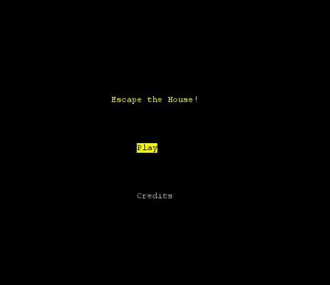
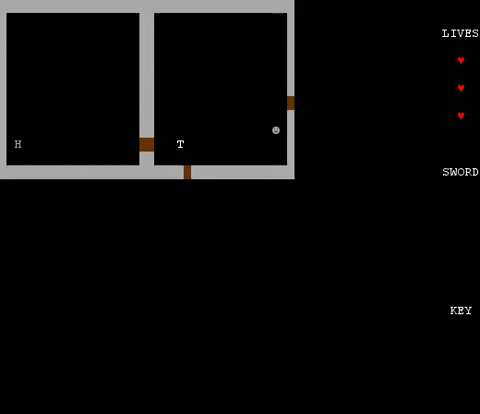

# 🏚️ Escape the House!

You wake up in an haunted house, full of monster with the front door locked! Explore the various floors of the house, seeking for
the key to escape, but always behare of the scary monster that haunt the house!

In [here](docs/README.md) you can find a completed report on the project.

This project was developed by José Macedo (up201705226@fe.up.pt) and Ricardo Nunes (up201706860@fe.up.pt).

## Screenshots
Here some screenshots of our game!

**Main Menu**

**Main Character Movement**

**Going through a door**

**Using a stair**

**Monster Movement**

**Monster Atack**

**Picking up an extra-life**

**Picking up an sword**

**Main Character Atack**

**Picking up an key**

**Game Over**

**Win Game**

