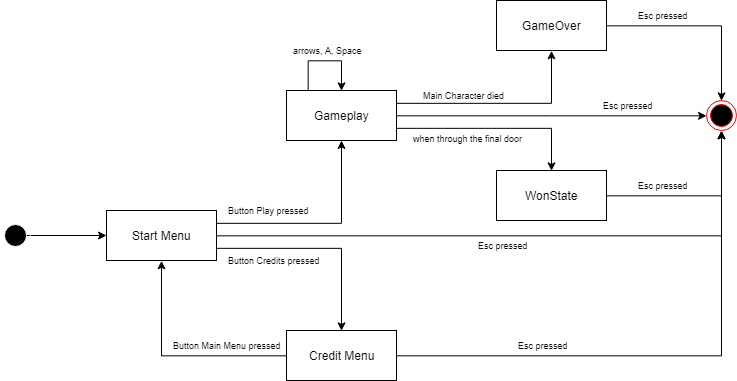

# 🏚️ Escape the House!


You wake up in an haunted house, full of monster with the front door locked! Explore the various floors of the house, seeking for
the key to escape, but always behare of the scary monster that haunt the house!

This project was developed by José Macedo (up201705226@fe.up.pt) and Ricardo Nunes (up201706860@fe.up.pt).


## Main Features
### Implemented
- **Movement:** By pressing the keyup, keydown, keyleft, keyright, you will be able to move Up, Down, Left and Right, respectively.
- **Attack:** Kill the monster by pressing the 'A' key! You can only do this if you equipped a sword.
- **Life:** Start the game having 3 hearts. Colliding with monsters cost you one heart, so becareful!
- **Items:** You will be able to pick up items, just by stepping on them! The list of items are:
  - **Extralife:** Gives you an heart;
  - **Sword:** Enables attak;
  - **Key:** Collect the key to open the final door!
- **Stairs:** When you step on a stair, you go the next floor!
- **Monster:** Behare of the monster! They move one position at random, once per second.
- **Ilumination:** When you enter a room, it gets illuminated! You can now see it even if you exit.
- **Menu:** The game will have a start menu, which connects to the gameplay menu. There will be also a credit, a "You Won" and a "Game Over" menu.
- **Timer:** When picking up the key, a timer will start! If you dont get to the door before the timer runs out, you loose!

---

## Game Structure
The following picture illustrates the underlying logical structure of our game.




For the full UML, click [here](../images/final_uml.png)

---

## Design Patterns
In this section, we will be exploring the 3 major problems that we faced and the 3 design patterns that we applied to resolve them: the **Game Loop**, **State** and **Observer** Patterns.


## The program should process input from user, change the data accordingly and run for a undetermined amount of time
### Problem in Context
A game should receive input from his user, process it and show the result on the screen. It should also run for an undetermined amount of time, dictated by the user, or by the game logic.
## The Pattern
By using the **Game Loop** Pattern, we can use all the problems above at once, using a loop to read input and udpate the model. To exit the game, we simply have to break the loop!
## Implementation


This classes can be found in the following clases:

- [GameLogic](../src/main/java/com/g77/logic/GameLogic.java)
- [GUI](../src/main/java/com/g77/gui/GUI.java)  
- [GameModel](../src/main/java/com/g77/data/GameModel.java)

## Consequences
The use of the Game Loop Pattern in the current design allows the following benefits:
- Allows the decouple of input processing and data changing.
- Introduces the possibility of different execution time to the program.


## Menus and gameplay have different actions for the same input
### Problem in Context
A down [Movement](../src/main/java/com/g77/gui/Move.java) has different meanings for the menus and gameplay. For example, to the meny represents going down on the button list. For the gameplay, however, it orders the Main Character to move down.
## The Pattern
The **State** Pattern "allow an object to alter its behavior when its internal state changes" (GoF). Now, we can have a MenuState and a GameplayState. This states are responsable for knowing what to do for the inputs the GameModel gives them.
## Implementation


This classes can be found in the following files:
- [GameModel](../src/main/java/com/g77/data/GameModel.java)
- [GameState](../src/main/java/com/g77/data/state/GameState.java)
- [GameplayState](../src/main/java/com/g77/data/state/GameplayState.java)
- [MenuState](../src/main/java/com/g77/data/state/MenuState.java)

### Consequences
Using the Game Loop Pattern has the folowing consequences:
- Partitions the behaviour in different states.
- Makes the changing of behaviour and states explicit. 


## When an action happens in the game, it must be shown on the screen
### Problem in Context
When we, the player, perfom an action, such as a movement or an attack, we want to see the result on the screen. But this raises a problem: How do we let the GUI (Graphic User Interface) know that something changed on the game and that we want to draw it again?
### The Pattern
To solve this problem, we used the **Observer** pattern. This pattern allows an object to be observed by several observers. The observers are always notified when the observed object changes. By setting up the object (GameModel) as an observable and the GUI as an observer, we allow communication between the two. Now, when GameModel changes, the GUI will be notify and draw it again.
### Implementation


This classes can be found in the following files:
- [Observer<T>](../src/main/java/com/g77/observer/Observer.java)
- [Observable<T>](../src/main/java/com/g77/observer/Observable.java)  
- [GameModel](../src/main/java/com/g77/data/GameModel.java)
- [GUI](../src/main/java/com/g77/gui/GUI.java)  

### Consequences
The use of the Observer Pattern in the current design allows the following benefits:
- GameModel doesn't need to know about GUI, which means, it promotes **abstract coupling** between GameModel and GUI.
- Any other class can now implement Observer and became a listener for GameModel. It enables **broadcast communication**.

---

## Known Code Smells and Refactoring Suggestions
In the following section, we will discuss the code smells present on our code, and our justifications for their presence

## Swich/if statements (Object-Orientation Abusers)
In this piece of code (located in [this](../src/main/java/com/g77/state/MenuState.java) file):
```java
 public void doMovement(Move move) {
        Menu currentMenu = this.gameModel.getCurrentMenu();
        if(move == Move.UP)
            currentMenu.goUp();
        else if(move == Move.DOWN)
            currentMenu.goDown();
        else if(move == Move.ENTER) {
            int nextMenu = currentMenu.selectButton();
            if(nextMenu == -1)
                changeStates();
            else
                this.gameModel.setCurrentMenu(nextMenu);
        }
      (...)
    }
```
We can observe a chain of if/else. This can become a problem if we intended to add more and more valid moves. Since this is not the case, we decided to keep it.

## Lazy Class (Dispensables)
Initially, we had plans for the class [Item](src/main/java/com/g77/data/objects/Item.java). It was supposed to contain a method ``wasSteppedOn()``, but after some reconsideration, we decided to create, instead, an interface [SteppedOn](../src/main/java/com/g77/data/objects/SteppedOn.java).
One way of solving this issue is by deleting the class and make the items directly extend [Object](../src/main/java/com/g77/data/objects/Object.java). However, the existence of this class allows a better structure of the code in the [GUI](../src/main/java/com/g77/gui/LanternaGUI.java) (it becomes more easy do modulate the code, with the function drawItems), so we made the decision of not deleting the class.

---

## Test Coverage Report


To see the full report, click [here](../report/Test_coverage/index.html)

---

## Mutation Testing


The [report](../report/Mutation_test/index.html) indicates that our tests succeded in killing most of the mutants (around 80%), has promised in the first report.

## Self-Evaluation
José Macedo: 50%

Ricardo Nunes: 50%
